<!-- ═══════════════════════════════════════════════════════════════ -->
<!--              PRATHAM SHUKLA — GITHUB PROFILE README            -->
<!-- ═══════════════════════════════════════════════════════════════ -->

<div align="center">
  
</div>

<br/>

<!-- ─── TELEMETRY BAR ─────────────────────────────────────────── -->
<div align="center">

<table>
<tr>
<td align="center" width="25%"><br/><b><code>3</code></b><br/><sub>PROJECTS</sub><br/><br/></td>
<td align="center" width="25%"><br/><b><code>5+</code></b><br/><sub>CTFs</sub><br/><br/></td>
<td align="center" width="25%"><br/><b><code>10+</code></b><br/><sub>SECURITY TOOLS</sub><br/><br/></td>
<td align="center" width="25%"><br/><b><code>2</code></b><br/><sub>LANGUAGES</sub><br/><br/></td>
</tr>
</table>

</div>

<br/>

<!-- ─── ABOUT ────────────────────────────────────────────────── -->
<table>
<tr>
<td valign="top" width="55%">

### `> whoami`

Computer Science student at **GLA University, Mathura** — building tools at the intersection of **digital forensics**, **threat detection**, and **network security**.

CTF researcher. Driven by the idea that understanding how systems break is the only real way to know how to defend them.

</td>
<td valign="top" width="45%">

```
CURRENT FOCUS
─────────────────────────────
▸ Web Application Security
▸ Digital Forensics
▸ Network Traffic Analysis
▸ Threat Detection Systems
▸ CTF Research
─────────────────────────────
STATUS: ACTIVE
```

</td>
</tr>
</table>

<br/>

---

<!-- ─── SECURITY SPECIALIZATION ───────────────────────────────── -->

### ░░ SECURITY SPECIALIZATION

<br/>

**Core Domains**


<br/>

**Languages & Tools**


<br/>

---

<!-- ─── PROJECT COMMAND CENTER ─────────────────────────────────── -->

### ░░ PROJECT COMMAND CENTER

<br/>

<table>
<tr>
<td width="50%" valign="top">
<h4>🛡️ <a href="https://github.com/Shukla-18/INTELLOG">INTELLOG</a></h4>
<code>OPERATION: INTELLOG</code> &nbsp; 
<br/><br/>
Hybrid Rule-Driven + AI-Assisted Cyber Forensics Investigation Platform
<br/><br/>


<br/><br/>
<a href="https://github.com/Shukla-18/INTELLOG"><code>→ VIEW REPOSITORY</code></a>
</td>
<td width="50%" valign="top">
<h4>🎣 <a href="https://github.com/Shukla-18/AI-Enabled-Phishing-Link-Detection-Alert-System">AI PHISHING DETECTION</a></h4>
<code>OPERATION: PHISHGUARD</code> &nbsp; 
<br/><br/>
AI-Enabled Phishing Link Detection & Real-time Alert System
<br/><br/>


<br/><br/>
<a href="https://github.com/Shukla-18/AI-Enabled-Phishing-Link-Detection-Alert-System"><code>→ VIEW REPOSITORY</code></a>
</td>
</tr>
<tr>
<td width="50%" valign="top">
<h4>📡 <a href="https://github.com/Shukla-18/Network-Traffic-Visualizer">NETWORK TRAFFIC VISUALIZER</a></h4>
<code>OPERATION: NETWATCH</code> &nbsp; 
<br/><br/>
Real-time Network Traffic Visualization & Protocol Analysis Dashboard
<br/><br/>


<br/><br/>
<a href="https://github.com/Shukla-18/Network-Traffic-Visualizer"><code>→ VIEW REPOSITORY</code></a>
</td>
<td width="50%" valign="top">
<h4>👁️ <a href="https://github.com/Shukla-18/Insider-Threat-Detection-System">INSIDER THREAT DETECTION</a></h4>
<code>OPERATION: SENTINEL</code> &nbsp; 
<br/><br/>
Behavioral Analysis System for Insider Threat Detection & Alerting
<br/><br/>


<br/><br/>
<a href="https://github.com/Shukla-18/Insider-Threat-Detection-System"><code>→ VIEW REPOSITORY</code></a>
</td>
</tr>
<tr>
<td colspan="2" valign="top">
<h4>🔎 <a href="https://github.com/Shukla-18/OSINT-Toolkit">OSINT TOOLKIT</a></h4>
<code>OPERATION: RECON</code> &nbsp; 
<br/><br/>
Open Source Intelligence Toolkit for Passive Reconnaissance & Security Research
<br/><br/>


&nbsp;&nbsp;&nbsp;<a href="https://github.com/Shukla-18/OSINT-Toolkit"><code>→ VIEW REPOSITORY</code></a>
</td>
</tr>
</table>

<br/>

---

<!-- ─── SECURITY LAB ───────────────────────────────────────────── -->

### ░░ SECURITY LAB

<br/>

<div align="center">

| Module | Domain | Status |
|:---:|:---|:---:|
| 🌐 **WEB** | Web Application Security · XSS · SQLi · CSRF · SSRF | `ACTIVE` |
| 🔐 **CRYPTO** | Cryptographic Analysis · Encoding Schemes · Hash Attacks | `ACTIVE` |
| 🔍 **FORENSICS** | Digital Forensics · File Carving · Timeline Analysis · EXIF | `CORE` |
| 👁 **OSINT** | Open Source Intelligence · Passive Recon · SOCMINT | `ACTIVE` |
| 🖼 **STEGANO** | Steganography · Hidden Data Extraction · LSB Analysis | `RESEARCH` |
| 📡 **NETWORK** | Packet Analysis · Protocol Inspection · PCAP Forensics | `ACTIVE` |
| ⚙️ **REVERSE** | Binary Analysis · Reversing · CTF Challenge Research | `LEARNING` |

</div>

<br/>

---

<!-- ─── GITHUB STATISTICS ──────────────────────────────────────── -->

### ░░ GITHUB STATISTICS

<br/>

<div align="center">


&nbsp;


</div>

<br/>

<div align="center">


</div>

<br/>

<!-- ─── CONTRIBUTION ACTIVITY ─────────────────────────────────── -->

### ░░ SECURITY ACTIVITY

<br/>

<div align="center">


</div>

<br/>

---

<!-- ─── FOOTER ─────────────────────────────────────────────────── -->

<div align="center">
  
</div>

<!-- ═══════════════════════════════════════════════════════════════ -->
